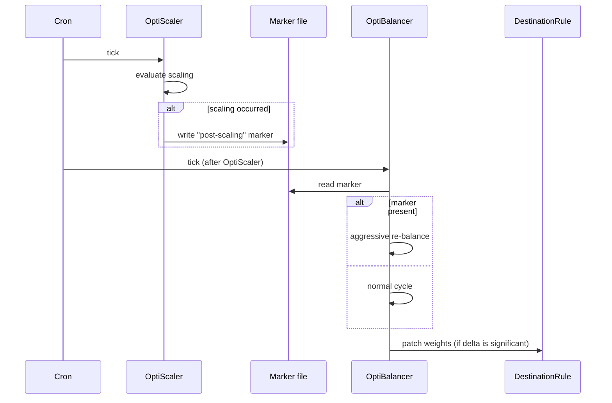

# OptiBalancer

OptiBalancer is the **traffic-shaping** engine. While OptiScaler decides *where Pods live*, OptiBalancer decides *what fraction of the requests each Pod receives*.

It does this by patching Istio `DestinationRule` resources with **per-locality weights** that reflect real-time conditions - not the snapshot from when the Deployment was first created.

<p align="center">
  
</p>

## What problem it solves

Out of the box, Istio (and `kube-proxy` itself) load-balances requests **uniformly** across endpoints. That assumption breaks the moment two replicas of the same service experience different conditions:

- One is on a node that is currently CPU-saturated.
- One is in a different zone - every request to it pays cross-AZ latency.
- One was just created - it has fewer warm connections than its siblings.
- One is failing slowly - its P95 is climbing but it has not yet been ejected.

Uniform load-balancing punishes the application for situations the application did not create. OptiBalancer continuously detects these asymmetries and **shifts traffic gradually** toward the replicas that are actually serving requests well.

## The three cases it handles

### Case 1 - even, healthy, same-zone replicas

<p align="center">
  
</p>

When all replicas of a downstream service live in the same zone and report similar latency and load, OptiBalancer keeps the split **even**. No write is issued - there is nothing to improve.

### Case 2 - replicas spread across zones, all healthy

<p align="center">
  
</p>

When healthy replicas are spread across zones, OptiBalancer preserves **locality**: callers prefer in-zone replicas, but a small reserve weight is kept on cross-zone replicas so that a zone failure shifts traffic smoothly instead of cliff-falling.

### Case 3 - a replica is degraded

<p align="center">
  
</p>

When one replica's P95 latency or CPU is significantly worse than its siblings, OptiBalancer **gradually reduces its share** - it does not yank traffic away in one step. The replica is given a chance to recover; only if it stays degraded does its weight keep falling.

The same engine handles the *node overloaded* scenario:

<p align="center">
  
</p>

## Why "gradual" matters

A traffic balancer that jumps to the new ideal split in one cycle will **oscillate**:

1. Replica A is slow → drop its weight from 50 % to 5 %.
2. Replica A is now idle → its metrics look great → push it back to 50 %.
3. Replica A is overwhelmed again → drop to 5 %.

OptiBalancer uses **adaptive damping** to prevent this:

- If the imbalance is small, it applies a **small** correction.
- If the imbalance is severe, it applies a **larger** correction - but still bounded by a configurable ceiling.
- If the change to a `DestinationRule` would be **below a minimum threshold**, it does not write at all (saves Istio API churn).
- If a per-route difference is **below epsilon**, that route is considered converged and left alone.

You can think of OptiBalancer as a **PID-style controller** for traffic - fast enough to react to real load shifts, slow enough to never oscillate.

## Where it writes

OptiBalancer's only side-effect is patching the `spec.trafficPolicy.loadBalancer.localityLbSetting.distribute` field (and the per-subset weights) of Istio `DestinationRule` resources.

It never:

- Creates new DestinationRules (you author those; it tunes them).
- Modifies your `VirtualService` routing rules.
- Touches `EnvoyFilter` or any low-level Envoy config.
- Changes anything outside the namespaces it is configured to monitor.

If you uninstall StornX, your DestinationRules stay exactly as they were on the last write - no cleanup, no regression. If you want to revert to uniform balancing, simply remove the weights yourself (or roll back the Helm release of your app).

## How it cooperates with OptiScaler



The handshake is intentionally minimal - a single marker file inside the StornX Pod. There is no message queue, no etcd entry, no shared state to corrupt.

## Observability

Every OptiBalancer cycle logs:

- The **current** weight distribution per `DestinationRule`.
- The **proposed** weight distribution and the L1 delta to current.
- Whether the write was **applied** or **skipped** (with the gate that suppressed it).
- Per-route convergence status.

Combined with Istio's own metrics (request rates per locality), this gives you a complete audit trail of every routing decision.

## When OptiBalancer is disabled

OptiBalancer activates only when **Istio is detected**. In an Istio-less cluster, OptiScaler continues to do its job (placement + autoscaling), and OptiBalancer logs a single startup line:

```
INFO  optibalancer  disabled  reason=istio-not-detected
```

Continue with [Integrations](./integrations) to see how StornX cooperates with Istio, Prometheus, and Kube-NetLag in detail.
