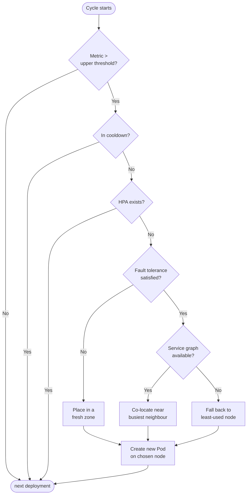
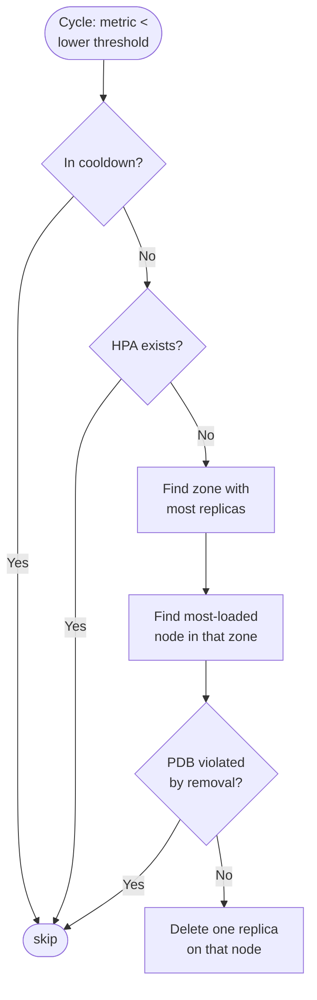

# OptiScaler

OptiScaler is the **placement and autoscaling** engine. It answers two questions every cycle, for every monitored Deployment:

1. Does this Deployment need **more or fewer** replicas?
2. If we add one, **on which node** should it run?

It does this while honouring three non-negotiable constraints: **fault tolerance**, **cooldown**, and **deference to existing HPAs and PDBs**.

## What problem it solves

The default Kubernetes scheduler decides placement **at Pod creation time** based on resource fit, taints, and affinity. It has no idea which Pods communicate with each other and no way to react when traffic shifts.

OptiScaler closes that gap. It picks the node for a new replica based on **where its actual neighbours already live**, and it picks the replica to remove based on **which node is doing the least useful work**.

<p align="center">
  
</p>

## The placement policy in one sentence

> **Spread until you are safe, then co-locate to be fast.**

This is the two-phase trade-off introduced in [Core Concepts](../introduction/core-concepts). Once the configured minimum number of zones is covered, OptiScaler starts using the **service communication graph** to pull new replicas toward their busiest neighbours.

### Phase A - fault-tolerance spread

<p align="center">
  
</p>

When a Deployment has fewer replicas than the minimum zone count, the next replica is placed in a **fresh zone** with sufficient capacity. The goal is pure resilience: a single AZ failure must never take the application down.

### Phase B - communication-aware co-location

<p align="center">
  
</p>

Once fault tolerance is satisfied, additional replicas land **closest to their heaviest neighbour**. "Heaviest" is defined by Istio request volume, not heuristics - if upstream traffic dominates, the new replica goes near the upstream; otherwise it goes near the downstream.

## Scale-up logic, end-to-end



A few things to notice:

- **HPA wins.** If an HPA already targets the Deployment, OptiScaler does not scale. It still influences placement of any Pods it creates itself, and OptiBalancer still routes traffic - but the replica **count** is owned by the HPA.
- **The graph is optional.** When no Istio metrics are available yet (new service, no traffic), the engine falls back to a Least-Frequently-Used node score so it never makes a "blind" decision.
- **Every decision is logged.** Every chosen node, every fallback, every skip has a structured log line with the reason - there are no silent black-box decisions.

## Scale-down logic

Scale-down is more conservative than scale-up. Removing the wrong Pod can violate a PDB, evict an important leader, or destabilise the service graph.

The policy:

1. Find the zone with the **most** replicas of this Deployment (i.e. the one that can afford to lose one).
2. Inside that zone, pick the **most loaded** node (so the load it sheds is the most useful).
3. Pick **any** replica of the Deployment on that node and remove it.
4. Before removal, run a **PDB check**: if removing this Pod would violate `minAvailable`, skip and try again next cycle.



## How node selection works (without the math)

OptiScaler exposes three node-selection strategies and picks the right one automatically:

| Strategy           | When it kicks in                                              | Intuition                                                   |
| ------------------ | ------------------------------------------------------------- | ----------------------------------------------------------- |
| **Upstream (Um)**  | The deployment has measurable inbound traffic                  | Put the replica next to whoever sends it the most requests  |
| **Downstream (Dm)**| The deployment has measurable outbound traffic to dependencies | Put the replica next to its busiest downstream dependency   |
| **LFU fallback**   | No service graph data yet (cold start, low traffic)           | Pick the node with the most spare CPU and memory            |

The combined score blends CPU, memory, and (optionally) bandwidth weights - all tunable from the Helm chart. **You do not need to understand the formula** to use StornX; the defaults converge fine for typical microservice workloads. The [Tuning guide](../guides/tuning) explains when to deviate from them.

## What you observe

When OptiScaler acts, you see log lines like:

```
INFO  scale-up    deployment=cart   reason=memory>80%   zone=eu-central-1b   node=ip-10-0-2-15   strategy=upstream-Um
INFO  scale-down  deployment=cart   reason=memory<20%   zone=eu-central-1a   node=ip-10-0-1-7    pdb-ok=true
INFO  skip        deployment=cart   reason=cooldown     remaining=42s
INFO  skip        deployment=cart   reason=hpa-managed
```

Every action is **traceable**, every skip is **explained**.

## What changes for your apps

Nothing. Your `Deployment` manifests, your `Service` definitions, your `HPA` resources, your `PodDisruptionBudget` policies - all of them remain untouched. OptiScaler **observes** them and either honours their decisions or fills the gaps they leave.

Next: [OptiBalancer](./optibalancer) - how traffic gets distributed once the layout is right.
