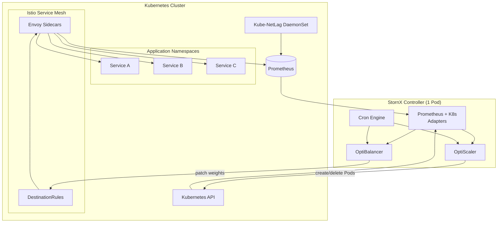

# Architecture Overview

StornX is a **single controller Pod** that orchestrates two cooperating engines - **OptiScaler** and **OptiBalancer** - driven by a cron loop and fed by Prometheus, the Kubernetes API and (optionally) Kube-NetLag.

<p align="center">
  
</p>

## High-level dataflow



## The two engines at a glance

| Engine          | Question it answers                                                                          | Output                                  |
| --------------- | -------------------------------------------------------------------------------------------- | --------------------------------------- |
| **OptiScaler**  | *Does this Deployment need more or fewer replicas, and on which node should they live?*       | Pod create / delete via the K8s API     |
| **OptiBalancer**| *Given the current set of replicas, how should incoming traffic be split between them?*       | Patched Istio `DestinationRule` weights |

They run in the **same cycle**, in this order:

1. **OptiScaler first** - placement changes the universe of replicas.
2. **OptiBalancer second** - once the new layout is known, traffic is redistributed.

When OptiScaler creates or deletes a Pod, it writes a small marker on disk so that OptiBalancer knows the next cycle is "post-scaling" and should re-evaluate weights more eagerly.

## The single-instance design

StornX runs as **exactly one replica**. This is deliberate:

- The decisions are global (placement + routing) - two instances racing would produce contradictory `DestinationRule` writes and oscillating Pod creation.
- A single Pod is trivially leader-elected (`replicas: 1`) and is cheap to run (it spends most cycles idle).
- If the StornX Pod dies, Kubernetes restarts it; the **only** consequence is a missed optimization cycle. Your applications continue to serve traffic exactly as before.

## Adapter layer

All interactions with the outside world go through a thin **adapter layer** so the core logic stays pure and unit-testable:

| Adapter           | Wraps                                                                 |
| ----------------- | --------------------------------------------------------------------- |
| `prometheus/*`    | PromQL queries for CPU, memory, request rate, P95, service graph     |
| `k8s/*`           | Typed access to Pods, Deployments, Nodes, HPAs, PDBs, DestinationRules |
| `filesystem/*`    | The inter-cycle "scaling happened" marker file                       |

This is why the [tests](https://github.com/AposLaz/StornX/tree/main/scheduler/tests) for OptiScaler and OptiBalancer run with **zero mocks of Kubernetes** - the adapter boundary is the only seam that needs replacing.

## Where the components sit in the codebase

```
scheduler/
└── src/
    ├── cronjobs/            ← Cron engine, the entry point of every cycle
    ├── core/
    │   ├── optiScaler/      ← Placement + scale up/down logic
    │   └── optiBalancer/    ← Traffic-weight calculation + DR patcher
    ├── adapters/
    │   ├── prometheus/      ← PromQL queries
    │   ├── k8s/             ← Kubernetes API wrappers
    │   └── filesystem/      ← Cross-cycle markers
    └── config/              ← Env config, logger, K8s client
```

The hierarchy is intentional: **`core/` knows nothing about Kubernetes or Prometheus**. It only consumes the typed interfaces in `adapters/`. Everything that talks to the outside world is replaceable.

## What gets written into the cluster

StornX needs surprisingly few API verbs:

| Resource             | Verbs                                |
| -------------------- | ------------------------------------ |
| `pods`               | `get`, `list`, `delete`, `create`    |
| `deployments`        | `get`, `list`, `patch` (scale)       |
| `nodes`              | `get`, `list`                        |
| `hpa`                | `get`, `list` (read-only - to detect) |
| `pdb`                | `get`, `list` (read-only - to respect) |
| `destinationrules`   | `get`, `list`, `patch`               |

The Helm chart ships RBAC that grants exactly this set, scoped to the configured namespaces.

## What happens when things go wrong

| Failure                              | StornX behaviour                                                |
| ------------------------------------ | --------------------------------------------------------------- |
| Prometheus unreachable               | The cycle is skipped, structured `WARN` log, retried next cycle |
| Istio not installed                  | OptiBalancer disables itself; OptiScaler continues alone        |
| Kube-NetLag absent                   | Latency-aware placement falls back to "same zone = best"        |
| Target Pod has no metrics yet (cold) | Deployment is ignored this cycle (no garbage decisions)         |
| StornX Pod itself crashes            | Kubernetes restarts it - no application traffic is affected     |

Next, dive into each engine: [OptiScaler](./optiscaler) and [OptiBalancer](./optibalancer).
