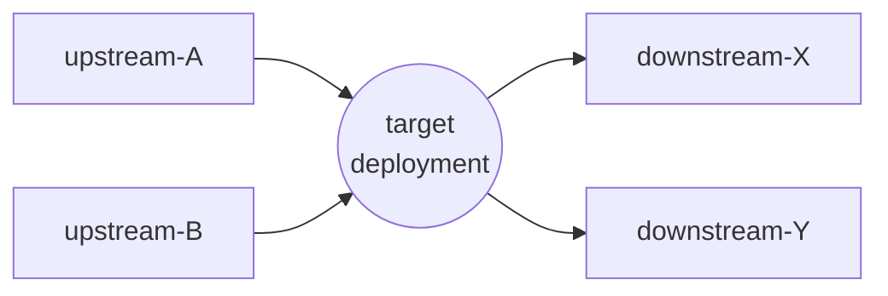

# Core Concepts

Before diving into the architecture, this page defines the vocabulary StornX uses. Each concept maps directly to a Kubernetes or Istio primitive - nothing is invented for its own sake.

## Pods, Nodes, Zones

  

- **Pod** - the smallest deployable unit; a single replica of an application.
- **Node** - a virtual or physical machine that hosts one or more Pods.
- **Availability Zone (AZ)** - a fault-isolated location inside a cloud region. Two nodes in the same region but different AZs are reachable, but every cross-AZ packet pays latency and (usually) a data-transfer fee.

  

StornX uses the standard Kubernetes well-known label `topology.kubernetes.io/zone` to identify a node's zone. No custom labels are required.

## Namespaces and scope

  

StornX operates **per namespace**, on a configurable list. A typical install monitors the namespaces that contain business workloads (e.g. `online-boutique`, `otel-demo`) and ignores system namespaces (`kube-system`, `istio-system`, `monitoring`).

## Upstream and downstream

StornX builds a **service communication graph** from the Istio mesh metrics exposed in Prometheus.

| Term                       | Meaning                                              |
| -------------------------- | ---------------------------------------------------- |
| **Upstream** Pods (`Um`)   | Pods that **send** requests to the Pod being placed  |
| **Downstream** Pods (`Dm`) | Pods that **receive** requests from the Pod being placed |

When OptiScaler needs to add a new replica, it asks: *"Which zone already holds the heaviest of this Deployment's neighbours?"* and prefers that zone - as long as fault tolerance is not violated.

## Locality

**Locality** is the property of running two communicating Pods on the same node, or at least in the same zone. StornX prefers same-node locality first, then same-zone, then cross-zone - but always subject to the fault-tolerance constraint described below.

Istio expresses locality through `localityLbSetting` and zone-weighted `DestinationRule` subsets. StornX produces these weights as outputs; it does not require you to write them by hand.

## Fault tolerance vs. efficiency

These two goals are in **direct tension**:

- **Pure efficiency** = pack all replicas onto one node in one zone → lowest possible latency, zero resilience.
- **Pure fault tolerance** = spread replicas across as many zones as possible → maximum resilience, highest latency and cost.

StornX resolves this trade-off with a **two-phase** policy:

1. **Spread phase** - until the configured minimum number of zones is covered (`FT_MAX_ZONES`, default `3`), every new replica goes to a fresh zone.
2. **Co-locate phase** - once fault tolerance is satisfied, additional replicas are placed close to their heaviest upstream or downstream neighbour.

  

This is the same pattern a senior SRE would apply manually - StornX just keeps it consistent across hundreds of Deployments, all the time.

## Metrics, thresholds and the decision cycle

Every cycle (default: 60 s) StornX evaluates each monitored Deployment against two thresholds:

| Signal                         | Source              | Used for                          |
| ------------------------------ | ------------------- | --------------------------------- |
| CPU / memory % vs request      | Prometheus + cAdvisor | Scale-up / scale-down trigger    |
| P95 response time              | Istio request_duration | Routing-weight calculation     |
| Request rate per source→target | Istio request_total | Service-graph construction        |
| Node-to-node latency           | Kube-NetLag         | Locality-aware placement          |

If a Deployment is **above** `METRICS_UPPER_THRESHOLD` (default 80 %) the cycle considers a scale-up; **below** `METRICS_LOWER_THRESHOLD` (default 20 %) it considers a scale-down. Between the two, the Deployment is "healthy" and only OptiBalancer may adjust its routing.

## Cooldown and safety guards

StornX always errs on the side of **stability**:

- A **cooldown** prevents a deployment from being scaled more than once per N seconds (default 60 s).
- An **HPA detector** skips any scaling decision when a `HorizontalPodAutoscaler` already targets the deployment.
- A **PodDisruptionBudget** check refuses a scale-down that would violate `minAvailable`.
- A **minimum delta** gate prevents micro-updates to Istio `DestinationRule` objects.

These guards mean StornX is safe to run in production from day one - the worst case it can produce is *"no decision this cycle"*, never a destructive one.

## Zero-downtime rescheduling

When StornX needs to move a replica from one node to another, it always:

1. Creates the **new** replica on the target node.
2. Waits until the new Pod reaches `Running` and passes its readiness probe.
3. Only then deletes the old Pod.

The application never experiences a drop in replica count.

You now have the vocabulary. Continue with [Architecture Overview](../architecture/overview).
