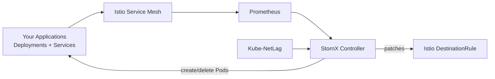

# What is StornX?

**StornX** is a Kubernetes control-plane extension that unifies three responsibilities that are usually handled in isolation by separate, communication-blind components:

1. **Horizontal autoscaling** of application replicas
2. **Replica placement** across nodes and availability zones
3. **Service-to-service traffic balancing** through the service mesh

By treating these three concerns as one coordinated decision loop, StornX continuously reshapes a running cluster so that the workloads that **talk to each other** also **live close to each other** and **receive traffic in proportion to where they perform best**.

  

## The 30-second pitch

> Vanilla Kubernetes places Pods once, scales them on a single CPU number, and sprays traffic randomly across replicas. StornX keeps watching, measures real communication patterns and latency, and rebalances both **placement** and **routing** in real time - without downtime, without manual tuning, and without replacing any of the components you already run.

## What StornX is, in practice

StornX is a **single-instance controller** that runs inside your cluster as one Pod. Every cycle (default: once per minute), it:

- Reads live metrics from **Prometheus** (CPU, memory, request rate, P95 latency, service graph).
- Reads node-to-node latency from **[Kube-NetLag](https://github.com/AposLaz/kube-netlag)** when available.
- Decides whether each monitored Deployment is **overloaded, underloaded, or healthy**.
- Picks the right node and zone to **add or remove** a replica, respecting fault-tolerance and PDB rules.
- Computes an **adaptive traffic split** and writes it into Istio `DestinationRule` objects so that the service mesh sends more traffic to faster, less loaded replicas.

All of this happens **without modifying** your Deployments, your HPAs, or your application code.

## What StornX is **not**

| It is **not**…                         | Because…                                                                                                                |
| -------------------------------------- | ----------------------------------------------------------------------------------------------------------------------- |
| A replacement for the kube-scheduler   | It cooperates with the default scheduler - it only **influences** placement of new replicas it creates.                  |
| A replacement for the HPA              | When an HPA already manages a Deployment, StornX **defers to it** and focuses only on placement and routing.            |
| A new service mesh                     | It reuses **Istio**'s `DestinationRule` API; it does not introduce any new data-plane.                                  |
| A monitoring tool                      | It is a **consumer** of Prometheus, not a producer of metrics dashboards.                                               |
| An ML / black-box system               | All decisions are **deterministic**, explainable, and bound by safe thresholds and cooldowns.                           |

## Where StornX fits

StornX sits **between observability and orchestration**. It does not own your workloads, it does not own the mesh - it owns the **decision** of *where* a Pod should run and *how* traffic should be split between replicas, and it keeps that decision optimal as conditions change.

## Who should use it

- Teams running **microservices on multi-AZ Kubernetes** (EKS, GKE, AKS, on-prem) where cross-zone hops dominate user-visible latency.
- Teams already using **Istio** and **Prometheus** that want more value out of the mesh than round-robin load balancing.
- Teams whose **cost reports** are driven primarily by inter-AZ data-transfer and over-provisioned replicas.
- Platform engineers who want a **single, opinionated** layer for autoscaling + placement + traffic shaping, instead of stitching together HPA, custom schedulers, and routing rules by hand.

## What you get out of the box

- A Helm chart (`stornx/stornx`) - one command to install.
- Cluster-scoped RBAC tuned to the minimum permissions required.
- Configurable per-namespace scope, thresholds, and routing aggressiveness.
- Full observability into every decision through structured logs.
- Zero application changes.

Continue with [Why StornX?](./why-stornx) to see the concrete problems it was built to solve.
